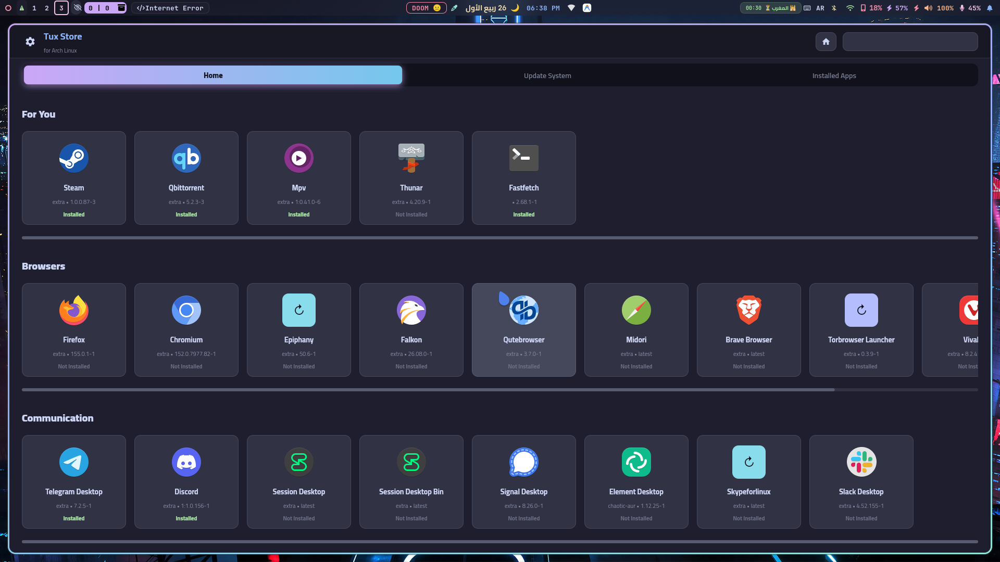
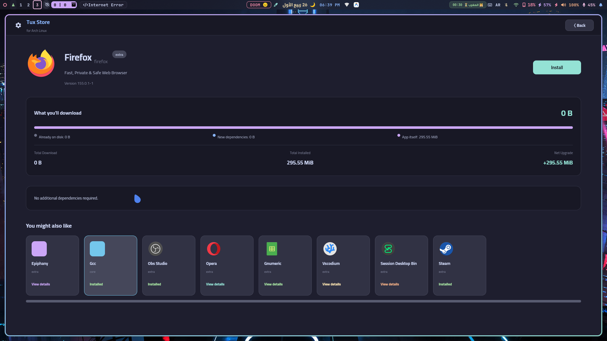
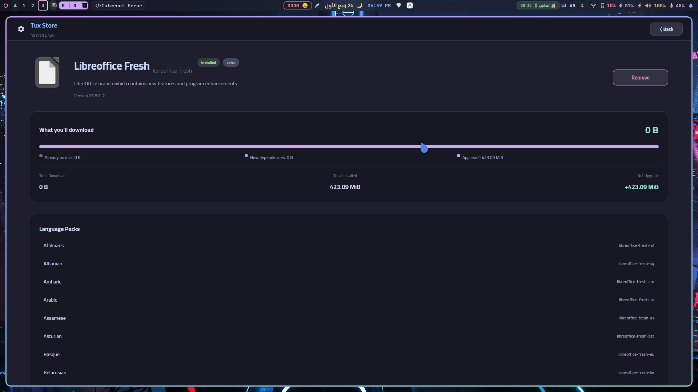
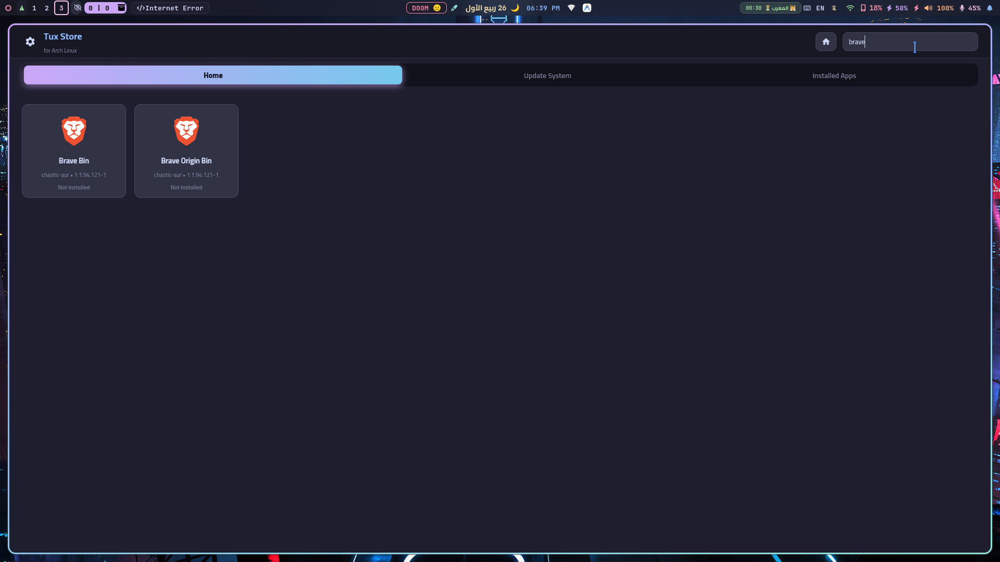
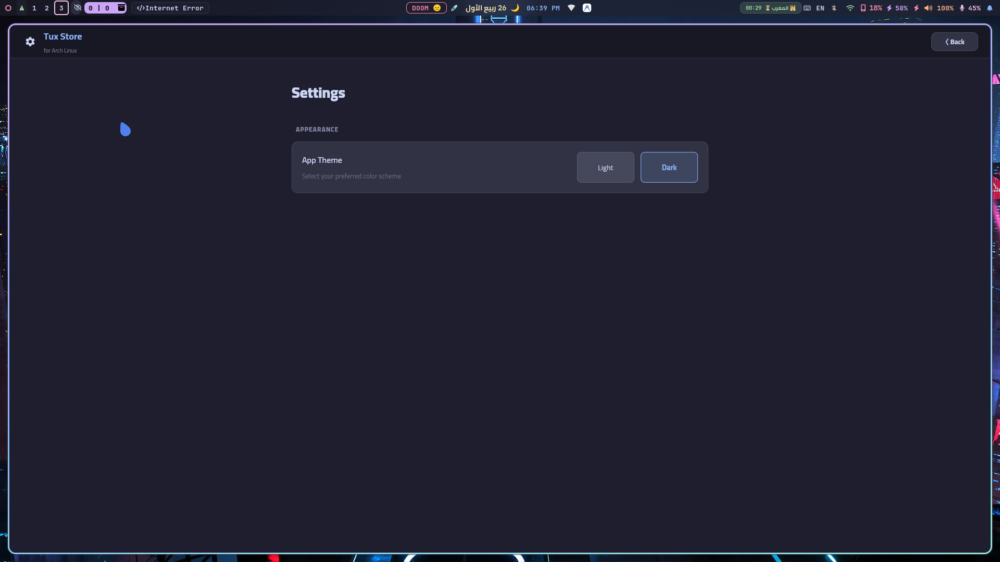
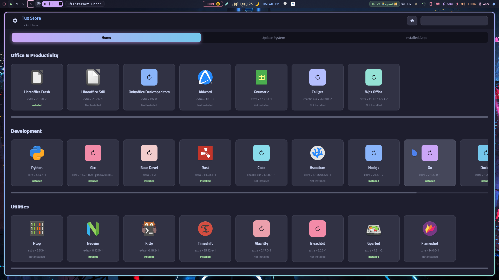

[🇬🇧 English](README.md)

# Tux Store

مدير حزم رسومي (GUI) خفيف وسريع مخصص لتوزيعة **Arch Linux**. واجهة المستخدم بالكامل مبنية باستخدام **Slint**، بينما تلعب مكتبة **Qt6** دور العقل المدبر وتدير العمليات في الخلفية. يقوم Tux Store بتغليف `pacman` في تجربة مستخدم سلسة تشبه متاجر التطبيقات: يمكنك تصفح التطبيقات المختارة، والبحث في المستودعات، وفحص الاعتماديات وأحجامها الفعلية قبل التثبيت، بالإضافة إلى مشاهدة شريط تقدم حي وحقيقي أثناء عمل `pacman`.


---

## الميزات

- **شاشة رئيسية منتقاة** — قائمة بتطبيقات شهيرة ومختارة بعناية، مع حالة التثبيت الفعلية التي يتم سحبها من `pacman -Q`.
- **بحث مرن (Fuzzy search)** — يبحث في قواعد بيانات المزامنة عبر `pacman -Ss`، مع تصفية ذكية تتجاهل المسافات، والحروف الكبيرة/الصغيرة، والشرطات، والنقاط.
- **تحليل حقيقي للاعتماديات والأحجام** — قبل التثبيت، يسأل Tux Store مدير الحزم (`pacman -Sp --print-format`) عن خطة التثبيت *الفعلية*: الاعتماديات الجديدة، وتلك المثبتة مسبقاً، وحجم التحميل، وحجم الترقية النهائي.
- **شريط تقدم حقيقي (Weighted install progress)** — يقرأ مخرجات `pacman` الحية من سطر الأوامر ويحولها إلى شريط تقدم سلس من 0 إلى 100٪، مع تقسيم مرئي بين "الاعتماديات الجديدة" و"التطبيق نفسه".
- **مراقب سطر الأوامر (Console viewer)** — نافذة تراكب اختيارية تعرض مخرجات `pacman` الأصلية كما هي لمن يريد رؤية ما يحدث بالضبط في الخلفية.
- **جلب ذكي للأيقونات** — يستخرج أيقونات التطبيقات من عدة مستودعات أيقونات شهيرة على GitHub (مثل Papirus, Tela, Fluent, WhiteSur, Qogir)، مع:
  - فحص ثيم الأيقونات في النظام أولاً (سريع، وبدون إنترنت).
  - إنشاء أسماء مرشحة بذكاء (عبر إزالة اللواحق، أو تقصير الأسماء).
  - حد أقصى للاتصالات المتزامنة حتى لا تتسبب الشبكة الكبيرة بفتح عشرات الاتصالات في وقت واحد.
  - حد زمني للطلبات مع نظام حماية للإلغاء الإجباري.
  - تخزين مؤقت على القرص (Caching) بحيث يتم جلب الأيقونات مرة واحدة فقط.
- **"ربما يعجبك أيضاً"** — رف اقتراحات عشوائية في صفحة التفاصيل لتشجيعك على اكتشاف برامج جديدة.
- **تثبيت بصلاحيات الجذر** — يستخدم `pkexec` للحصول على الصلاحيات، أو يعمل مباشرة إذا كان المستخدم هو الجذر (root).
- **الإضافات وحزم اللغات (Addons)** — يعمل بنظام إعدادات JSON محلي (في مجلد `special_case_packages/`) لربط الحزم بإضافاتها بسلاسة (مثل حزم لغات LibreOffice). الضغط على الإضافة يكتشف تلقائياً الحزمة الأصلية ويربطك بها!

## صور من داخل البرنامج (Screenshots)








## المتطلبات

- **Arch Linux** (أو أي توزيعة مبنية عليها) مع `pacman` و (اختيارياً) `pkexec`/Polkit.
- **CMake** ≥ 3.21
- **مترجم C++20** (GCC أو Clang)
- **Qt6** — `Core`, `Gui`, `Network`, `Concurrent`
- **Slint** (C++ API) — راجع [slint.dev](https://slint.dev) لتعليمات التثبيت.

في Arch Linux، يمكن تثبيت معظم المتطلبات عبر:

```bash
sudo pacman -S cmake qt6-base gcc
```

(ملاحظة: Slint ليس متوفراً حالياً كحزمة مبنية مسبقاً في المستودعات الرسمية لـ Arch؛ قم بتثبيته حسب [دليل Slint C++](https://releases.slint.dev/latest/docs/cpp/)).

## البناء والتثبيت

```bash
cmake . && make -j$(nproc)
```

هذا سينتج ملف تنفيذي باسم `tuxstore` في المجلد الرئيسي.

لتشغيله:

```bash
./tuxstore
```

> **ملاحظة:** تثبيت الحزم سيؤدي إلى ظهور نافذة مطالبة بكلمة المرور (`pkexec`/Polkit) ما لم يكن Tux Store يعمل بصلاحيات الجذر مسبقاً.

## هيكلة المشروع

```
├── include/                # ترويسات عامة لجميع أصناف الكواليس (backend)
├── src/                    # كود التشغيل في الخلفية (Qt/C++) + main.cpp
├── ui/                     # واجهة المستخدم Slint (صفحات، مكونات، ثيمات)
├── special_case_packages/  # إعدادات JSON للإضافات وحزم اللغات
├── DOCS/                   # توثيق موسع للمطورين
├── CMakeLists.txt
└── README.md
```

## التوثيق

التوثيق الكامل للمطورين — الهيكلية، تفاصيل كل مكون، تدفق البيانات بين Qt و Slint، ودليل المساهمة — موجود في مجلد [`DOCS/`](DOCS/README.md). ابدأ من هناك إذا كنت تخطط للمساهمة أو تريد فهم كيفية عمل جزء معين.

روابط سريعة:

- [نظرة عامة على الهيكلية](DOCS/ARCHITECTURE.md)
- [PacmanManager](DOCS/PACMAN_MANAGER.md)
- [InstallManager](DOCS/INSTALL_MANAGER.md)
- [IconFetcher](DOCS/ICON_FETCHER.md)
- [Package / Data Model](DOCS/PACKAGE_MODEL.md)
- [واجهة المستخدم (Slint)](DOCS/UI_LAYER.md)
- [التسجيل (Logging)](DOCS/LOGGING.md)
- [كيفية المساهمة](DOCS/CONTRIBUTING.md)

## كيف يعمل؟ (باختصار)

1. عند التشغيل، يقوم `PacmanManager::fetchDefaults()` بتشغيل `pacman -Q` على قائمة التطبيقات المختارة خارج مسار الواجهة (عبر `QtConcurrent`) ويملأ الشاشة الرئيسية.
2. يتم جلب الأيقونات بشكل كسول لكل بطاقة عبر `IconFetcher`، والذي يتحقق من الذاكرة المؤقتة ثم ثيم النظام ثم مستودعات الأيقونات على GitHub.
3. النقر على تطبيق يستدعي `PacmanManager::fetchDetails()`، والذي يستخدم مخطط `pacman` الفعلي لمعرفة الأحجام الدقيقة والاعتماديات الجديدة والمثبتة مسبقاً.
4. النقر على **تثبيت (Install)** يمرر اسم الحزمة وأحجامها إلى `InstallManager`، الذي يشغل `pacman -S` (عبر `pkexec`)، ويقرأ المخرجات سطراً بسطر ليحسب نسبة التقدم الحقيقية.
5. واجهة Slint (`ui/main.slint`) هي واجهة خفيفة وتفاعلية تعتمد على بيانات صريحة (`UiPackage`، `UiPackageDetails`، `UiInstallState`) يرسلها `main.cpp` لتبقى الواجهة متزامنة مع ما يحدث بالخلف.

## الترخيص

[GPL v3](./LICENSE)

## المساهمة

نرحب بالمساهمات! يرجى قراءة [`DOCS/CONTRIBUTING.md`](DOCS/CONTRIBUTING.md) قبل فتح أي Pull Request — فهو يغطي أسلوب الكود، معايير التسجيل (logging)، وكيفية الحفاظ على الفصل بين Qt و Slint.
